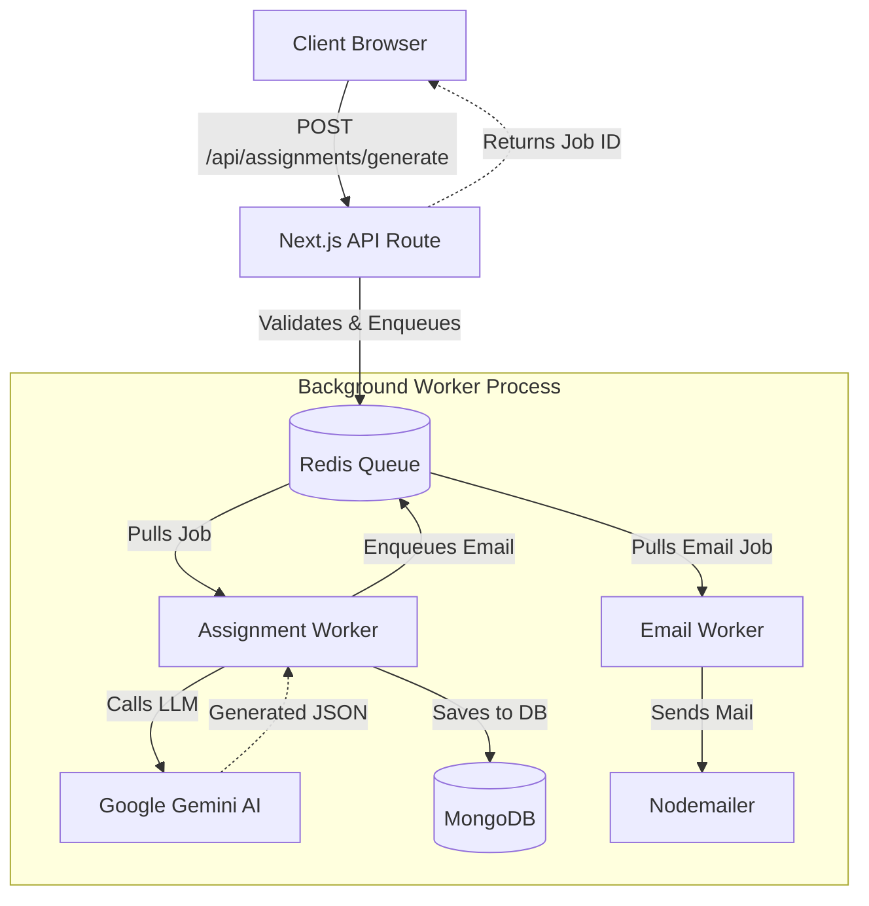

# AssessMind - AI-Powered Assessment Generator

AssessMind is a modern, full-stack web application designed to automatically generate high-quality assignments and assessments using Artificial Intelligence. It leverages the Vercel AI SDK with Google's Gemini models and robust background job processing for seamless user experiences.

## 🏗️ System Architecture & Design

This project is built using a modern decoupled architecture that separates the frontend interaction layer from heavy background processing tasks.

### Technology Stack

* **Frontend:** Next.js 16 (App Router), React 19, Tailwind CSS v4, Shadcn UI, Redux Toolkit
* **Backend API:** Next.js Serverless API Routes
* **Database:** MongoDB (via Mongoose)
* **Message Queue / Job Processing:** BullMQ & Redis
* **AI Engine:** Vercel AI SDK (@ai-sdk/google) with Gemini
* **Authentication:** Custom JWT-based auth via Next.js Middleware
* **Monitoring:** Bull-Board (Queue UI)

### High-Level Workflow



### Core Components

1. **Next.js Web App:**
   - Handles the user interface, routing, state management (Redux), and authentication.
   - API routes (`/api/*`) act as the gateway to the database and background queues. When a user requests an assignment, the API responds instantly after placing a job in the queue, rather than blocking the UI while the AI generates the content.

2. **Redis & BullMQ:**
   - A Redis container (via Docker Compose) acts as the central message broker.
   - **BullMQ** manages two primary queues: `assignment-generation` and `email-notification`.

3. **Background Worker Process (`worker.ts`):**
   - A standalone Node.js process (run via `npm run worker`) that actively listens to Redis queues.
   - **Assignment Worker:** Picks up generation tasks, constructs AI prompts, streams requests to Gemini, parses the returned assignment, saves it to MongoDB, and then triggers an email notification job.
   - **Email Worker:** Picks up email tasks and dispatches success notifications to users via Nodemailer.

4. **Queue Monitoring Dashboard (`bull-board.ts`):**
   - A dedicated Express server providing a UI to monitor, pause, and retry BullMQ jobs in real-time.

## 🚀 Getting Started

### Prerequisites
- Node.js (v20+)
- Docker (for running Redis)
- MongoDB Cluster (or local instance)

### 1. Environment Setup
Clone the repository and install dependencies:
```bash
npm install
```

Ensure your `.env` or `.env.local` contains the necessary variables:
```env
# Database
MONGODB_URI=mongodb+srv://<user>:<password>@cluster.mongodb.net/...

# Auth
JWT_SECRET=your_jwt_secret

# AI
GEMINI_API_KEY=your_gemini_api_key

# Redis
REDIS_URL=redis://127.0.0.1:6379

# Email
EMAIL_USER=your_email@gmail.com
EMAIL_PASS=your_app_password
```

### 2. Start Redis
Start the Redis server using Docker Compose:
```bash
docker compose up -d
```

### 3. Run the Application Services

You will need to run the following commands in separate terminal tabs:

**Start the Next.js Frontend & API:**
```bash
npm run dev
```
*(Runs on http://localhost:3000)*

**Start the Background Worker Process:**
```bash
npm run worker
```
*(Listens to BullMQ queues and processes AI & Email tasks)*

**Start the Queue Dashboard (Optional):**
```bash
npm run board
```
*(Runs on http://localhost:3001/admin/queues - View active, failed, and completed jobs)*
